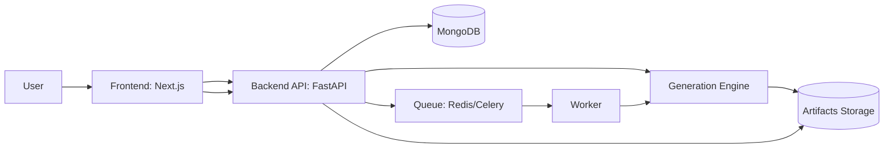
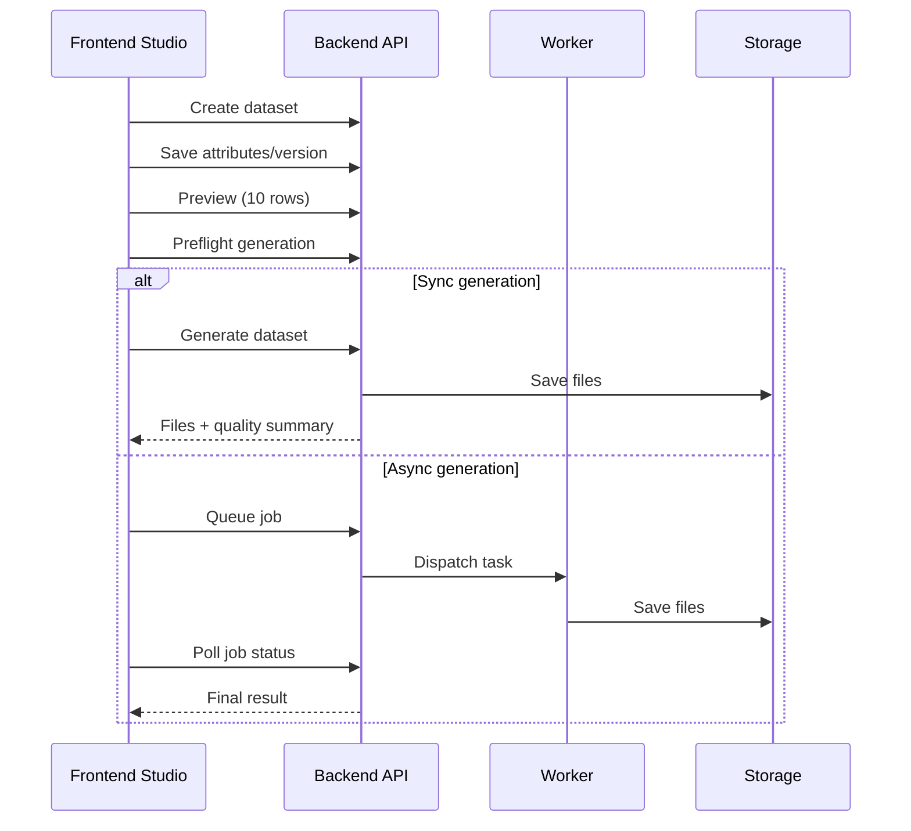

# DataSim-Labs

<div align="center">

Synthetic Data Generation Platform for schema-driven, high-volume dataset synthesis.

[](LICENSE)
[](backend/requirements.txt)
[](backend)
[](frontend)
[](frontend)
[](#)

</div>

---

## Table of Contents

- [Overview](#overview)
- [Platform Snapshot](#platform-snapshot)
- [Visual Architecture](#visual-architecture)
- [How It Works](#how-it-works)
- [Features](#features)
- [Tech Stack](#tech-stack)
- [Quick Start](#quick-start)
- [API Surface](#api-surface)
- [Project Layout](#project-layout)
- [Security](#security)
- [Contributing](#contributing)
- [License](#license)

## Overview

DataSim-Labs is a full-stack platform for defining synthetic dataset schemas, previewing generated records, and exporting datasets in multiple formats.

It is designed for product teams, data teams, and developers who need repeatable synthetic datasets for testing, demos, and analytics workflows.

## Platform Snapshot

| Area          | What You Get                                                                 |
| ------------- | ---------------------------------------------------------------------------- |
| Data Modeling | Typed attributes, constraints, null controls, and configurable distributions |
| Generation    | Sync and async workflows with preflight checks for safe execution            |
| Outputs       | CSV, JSON, JSONL, and Excel exports                                          |
| Quality       | Validation summary and guardrails in generation response                     |
| Security      | Cookie-based auth with refresh rotation and structured API errors            |
| UX            | Guided studio flow, diagnostics, and actionable error feedback               |

## Visual Architecture



## How It Works



## Features

- Schema-driven synthetic generation with per-column constraints
- Dataset versioning with reproducibility via seed
- Preflight safety checks before full generation
- Async generation for larger workloads
- Multi-format artifact export (CSV/JSON/JSONL/XLSX)
- Runtime quality diagnostics and validation summary
- Structured error responses and request correlation IDs

## Tech Stack

### Backend

- FastAPI
- Pydantic + pydantic-settings
- Pandas, NumPy, SciPy, Faker
- Celery + Redis

### Frontend

- Next.js (App Router)
- React + TypeScript
- Tailwind CSS
- TanStack Table

## Quick Start

### Prerequisites

- Python 3.11+
- Node.js 20+
- npm 10+
- MongoDB
- Redis (for async job execution)

### 1) Configure Environment

Copy templates:

- `backend/.env.example` -> `backend/.env`
- `frontend/.env.example` -> `frontend/.env`

Set strong values for sensitive environment variables.

### 2) Start Backend

```bash
cd backend
venv\Scripts\activate
pip install -r requirements.txt
python run_services.py
```

`run_services.py` starts the API server and, when `ASYNC_GENERATION_ENABLED=true`, a Celery worker process.

### 3) Start Frontend

```bash
cd frontend
npm install
npm run dev
```

### 4) Open

- Frontend: http://localhost:3000
- Backend API docs: http://localhost:8000/docs

## API Surface

### Auth

- `POST /api/v1/auth/register`
- `POST /api/v1/auth/login`
- `POST /api/v1/auth/refresh`
- `POST /api/v1/auth/logout`
- `GET /api/v1/auth/me`

### Dataset Lifecycle

- `GET /api/v1/dataset/templates`
- `POST /api/v1/dataset/create`
- `POST /api/v1/dataset/attributes`
- `POST /api/v1/dataset/preview`
- `POST /api/v1/dataset/preflight`
- `POST /api/v1/dataset/generate`
- `POST /api/v1/dataset/generate-async`
- `GET /api/v1/dataset/jobs`
- `GET /api/v1/dataset/jobs/{job_id}`
- `POST /api/v1/dataset/jobs/{job_id}/cancel`
- `POST /api/v1/dataset/jobs/{job_id}/retry`
- `GET /api/v1/dataset/download/{dataset_id}`
- `GET /api/v1/dataset/list`
- `GET /api/v1/dataset/{dataset_id}`
- `GET /api/v1/dataset/{dataset_id}/versions`

### Semantic Rules

- `GET /api/v1/rules/dataset/{dataset_version_id}`
- `POST /api/v1/rules/filter`
- `POST /api/v1/rules/validate`
- `POST /api/v1/rules/apply`

### System

- `GET /health`

## Project Layout

```text
.
|-- backend/
|   |-- app/
|   |-- requirements.txt
|   `-- run_services.py
|-- frontend/
|   `-- src/
|-- docs/
|-- README.md
`-- railway.toml
```

## Security

- Never commit `.env` files, tokens, or secrets
- Use strong and rotated secrets for JWT and API keys
- Keep dependencies updated and monitor advisories

See `SECURITY.md` for private vulnerability reporting guidance.

## Contributing

Contributions are welcome. Please review `CONTRIBUTING.md` before opening a pull request.

## License

This project is licensed under the MIT License. See `LICENSE` for full text.
